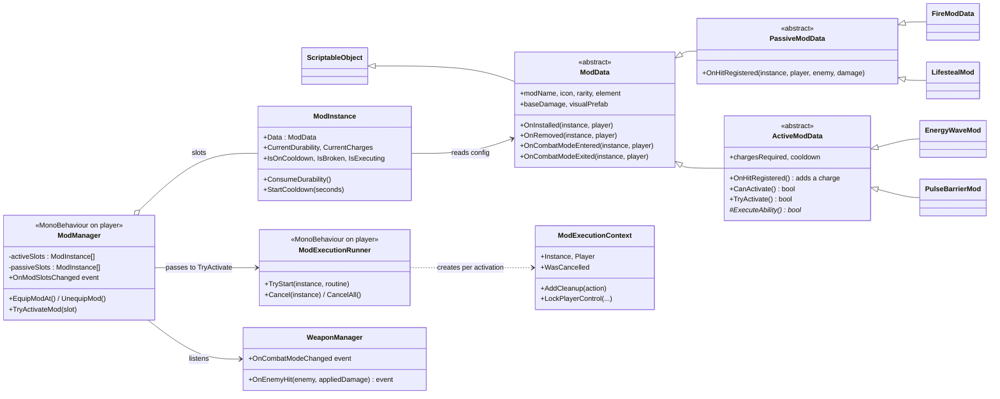

# JunkLite: programmer & game designer guide

Read this before working on JunkLite, with or without AI agents. It's the short version. Details live in:
- `MAIN_MECHANICS.md`: how the game plays.
- `ARCHITECTURE_HANDOFF.md`: code status and known gaps.
- `AGENTS.md`: the rules agents follow.

---

## 1. The game in 30 seconds

- **2.5D side-scroller.** 2D Spine characters in a full 3D world (URP), single-player, Unity 6.
- You move **left and right on a lane**. A lane is a straight line along world X or Z.
- **The world rotates.** At the end of a lane, a **Camera Switch Trigger** swings the camera 90°, puts you on a new lane, and the level continues. The reference is `Scenes/Level 1/V2/Rooftop Scene v2`.
- **Free-move rooms** (safe and explore rooms, e.g. Service Floor Room 0) lead into lane rooms through a door. You press **E to proceed**, which snaps you onto the lane.
- **Combat / mod mode.** **Q** or a left-stick click toggles it. It needs a weapon. Weapons show and mods become active.

---

## 2. Working with AI agents

- Agents read `AGENTS.md` first. Keep rules there; `CLAUDE.md` and `GEMINI.md` just point to it.
- Agents edit scenes and assets through the **Unity CLI** connected to your open Editor. Setup is in `AGENTS.md`; check it with `unity status`.
- Agents ask before saving scenes. **Check the Editor before you approve a save.** Everything they do is undoable until then.
- When something changes how the game plays, update `MAIN_MECHANICS.md` (and `AGENTS.md` if it's a rule) in the same change.

---

## 3. Lanes & pathing (setting up a level)

**A lane path is not a spline.** It's a chain of straight segments. It only *places* characters on the lane; the player's controller does the moving.

### Set up a lane path
1. Under `[Gameplay]`, create an empty object, e.g. `LanePath_Room1-8`, at position 0, 0, 0.
2. Add the **Lane Path** component.
3. Add child empties `Point_0`, `Point_1`, … **The hierarchy order is the path order.**
4. Neighbouring points may differ in **X only or Z only**. Height (Y) is ignored. The line drawn in the Scene view is **cyan** when the segment is valid and **red** when it isn't axis-aligned.
5. The line's depth (Z, or X after a turn) is where the player walks, so it must pass through every doorway.

### "E to proceed" entry
1. Under `[Gameplay]`, create an empty object and add a **Box Collider** and a **Lane Entry Trigger**.
2. Size the box to cover the area in front of the exit door.
3. Assign **Lane Path**, plus **Gate Door** (a `Door4_Sliding`, which stays locked until the player presses E).
4. Start the path just inside the trigger, so pressing E only shifts the player sideways.

### Corners (world rotation)
1. Add a point at the corner and a point along the new direction.
2. Place a `CameraSwitchTrigger` prefab at the corner. Put its **A** point on the old line and its **B** point on the new line.
3. Set the rotations and cameras from this table:

| Direction | Rotation | Camera |
| --- | --- | --- |
| +X | 0 | PosZCam |
| +Z | −90 | NegXCam |
| −X | −180 | NegZCam |
| −Z | −270 | PosXCam |

### Enemies
Place them roughly on the lane, then run **Tools > JunkLite > Level > Snap All Enemies To Lane Path**. An enemy's facing (Y rotation) decides its lane.

### Limits
- **No curves.** Build a spiral staircase as straight flights with a 90° corner at each landing.
- Use one path per continuous lane.

---

## 4. Level building rules

- **Few colliders, kept separate from art (for performance).**
  - All level collision lives under the **`Colliders`** root: a handful of big boxes.
  - `Colliders/Floors` has one strip per lane section that follows the path, one flat square per free-move room, and ramps.
  - `Colliders/Walls` has room perimeters and lane ends.
  - Art meshes have **no colliders**, except door prefabs. Never use mesh colliders.
  - When you extend a lane, stretch or add a floor strip.
- **Hierarchy:**
  - `[Gameplay]` holds the spawn point, lane paths, entry triggers and camera switch triggers.
  - `[Environment]/Shared` holds pieces that span several rooms.
  - Everything else goes in `[Environment]/Room N/<Category>`. The categories are Ceiling, Doors, Dressing, Floors, Foreground, Gameplay, Lighting, Props, Structure and Walls.
- **Doors** between rooms use `Prefabs/Environment/Doors/Door4_Sliding`. It opens when the player is close, and its blocker collider switches off once it's open. Lane doors use Y rotation 270 and scale 2.87.
- **Spawn point** rotation must match the first lane.
- **Walk the whole lane in Play mode** before saving a level.

---

## 5. Dev tools

| Tool | Where | Use |
| --- | --- | --- |
| **Dev Console** (in-game) | **F10** in Play mode (Editor only). Enable it with **JunkLite > Dev Tools > Enable In-Game Panel**. Status window: **JunkLite > Dev Tools Console**. | Player tab: infinite ammo and durability, heal, invincible, unlock mod slots, clear inventory, defeat, respawn. Spawn tab: enemies, weapons, mods. Mods tab and Run tab (run control). |
| **Performance overlay** | **F9** in Play mode | FPS, frame time, and a spike graph. Spikes are logged to CSV (**Tools > JunkLite > Performance > Open Frame Spike Logs**). |
| **Level tools** | **Tools > JunkLite > Level** | Snap Selected / Snap All Enemies To Lane Path; Replace Mesh Colliders With Boxes; Remove Mesh Colliders. Each is one Undo step. |
| **Validators** | **Tools > JunkLite > Systems > Validate**, **Validate Enemies**, **Validate Encounters** | Check scene setup: Game Root, cameras, enemies, encounters. |
| **Performance helpers** | **Tools > JunkLite > Performance** | Optimize audio imports; enable world texture streaming. |
| **Font rebuild** | **JunkLite > UI > Rebuild New UI Font Assets** | Run it when TMP glyphs are missing. |
| **Tests** | `Assets/Game/Tests/Editor` (Test Runner, EditMode) | Run after touching damage, locks, or lifecycle code. |

⚠️ **Tools > JunkLite > Systems > Rebuild** rewrites the V2.5 scene. Only run it on purpose.

---

## 6. ScriptableObjects: config, never state

**ScriptableObjects (SOs) are read-only design data.** Designers edit them in the Inspector; code reads them.
- **Never store runtime state on an SO** (current HP, cooldown timers, charges, durability left). SOs are shared assets, so state written to one leaks between instances and into the next play session in the Editor.
- Runtime state lives on an **instance** created from the SO:
  - `ModData` → `ModInstance` (a plain C# object per slot)
  - `WeaponData` → `WeaponInstance` (a component on the spawned weapon)

| Create menu (right-click > Create) | Asset | What it configures |
| --- | --- | --- |
| Junklite/Mods/… (Fire, Electric, Lifesteal, Pogo, Energy Wave, Pulse Barrier, Phantom Strike, Social Distance, Dont Blink) | `ModData` subclasses | Mod name, icon, rarity, element, damage, charges, cooldown, VFX prefab |
| Junklite/Melee Weapon Data, Junklite/Ranged Weapon Data | `WeaponData` | Weapon stats, combos, projectiles |
| Junklite/Character Stats | `CharacterStats` | Player base stats (e.g. `Player Stats.asset`) |
| JunkLite/Enemy Config | `EnemyConfig` | Enemy tuning per archetype |
| Junklite/Combat/Status Effect | `StatusEffectDefinition` | Burn, shock, and similar effects |
| Junklite/Drop Table | `DropTable` | Loot drops |
| Junklite/Audio/Player Sound Profile, Enemy Sound Profile, Audio Library | Audio SOs | Sound sets |
| Dialogue/Sequence | `DialogueSequence` | Dialogue lines and speakers |
| JunkLite/UI Font Catalog | `UIFontCatalog` | The three approved fonts (don't duplicate it) |

---

## 7. Mod system

**Concepts**
- A **mod** is a ScriptableObject (`ModData`) plus a runtime `ModInstance` per equipped slot.
- **Passive mods** run automatically while you're in mod (combat) mode, e.g. Fire, Electric, Lifesteal, Pogo.
- **Active mods** are triggered by their input. They build **charges** on hits and then go on **cooldown**, e.g. Energy Wave, Pulse Barrier, Phantom Strike.
- Each successful use consumes **durability**. A mod at 0 durability is **broken** and stops working.
- `ModManager` (on the player) owns the slots. Slots unlock over time (`UnlockActiveSlot` / `UnlockPassiveSlot`).
- Long abilities (dashes, channels) run through the player's `ModExecutionRunner`. It gives each activation a `ModExecutionContext` that owns cleanup and input, movement and immunity locks, so cancelling, dying, or leaving mod mode always cleans up.

**Flow**
1. The player toggles mod mode, and `WeaponManager.OnCombatModeChanged` fires. `ModManager` then calls `OnCombatModeEntered` or `OnCombatModeExited` on each equipped, unbroken mod.
2. A hit lands, and `WeaponManager.OnEnemyHit` fires with the **actually applied** damage. Every equipped mod gets `OnHitRegistered`: passives react, and actives gain a charge.
3. The mod input calls `ModManager.TryActivateMod(slot)`, which runs `ActiveModData.TryActivate`:
   - It checks `CanActivate` (not running, not on cooldown, enough charges).
   - It calls `ExecuteAbility`.
   - If the ability was used, it starts the cooldown, and `ModManager` consumes durability.
4. A long ability calls `executionRunner.TryStart(instance, ctx => Routine(ctx))`. Inside, it takes locks via `ctx.LockPlayerControl(...)` and registers `ctx.AddCleanup(...)`. Both are released automatically on finish, cancel, removal, mode exit, disable, or death.

**Making a new mod**
1. Create a class deriving from `PassiveModData` or `ActiveModData` and give it `[CreateAssetMenu(menuName = "Junklite/Mods/Your Mod")]`.
2. Override the hooks you need. For an active mod, implement `ExecuteAbility`, and don't call `StartCooldown` yourself.
3. Put any per-use state on the `ModInstance` or inside the execution routine, **never on the SO**.
4. Create the asset, fill in name, icon, damage, charges and cooldown, then spawn it with the **Dev Console > Spawn > Mods** tab to test.

**Lifecycle rule:** `OnInstalled` / `OnRemoved` mean the mod is in a slot. `OnCombatModeEntered` / `OnCombatModeExited` mean it's currently usable. Don't mix them up.

---

## 8. Core code rules

- **Damage has one path.**
  - Build a `DamageRequest`, send it to an `IDamageReceiver`, and react only to a successful `DamageResult` (its *applied* amount).
  - Hit VFX, hit-stop, lifesteal and durability all key off the result.
  - Deduplicate targets in area and piercing attacks.
- **Player and enemies don't share a base class.**
  - `PlayerCharacter` owns its own input, parry, death and respawn.
  - Enemies derive from `EnemyBase`, with AI composed per type.
- **Weapons.** UI listens to `PlayerWeaponLoadout`, which owns the slots. `WeaponManager` owns combat.
- **Managers.**
  - The persistent **Game Root** holds GameManager, PlayerLifecycle, GameUIManager, input, the combat tracker and UI.
  - Each scene has a scene-local `CameraManager` and Level Context.
  - Get the player from `PlayerLifecycle.PlayerSpawned`, not through `GameManager`.
- **Locks are leases.** Input, movement and immunity locks are taken and released through disposable scopes. Never set or clear them by hand.
- **UI.** Use TextMeshPro UGUI with only three fonts: Play (in-world), ZuumeEdge (HUD titles) and Satoshi (HUD body). Apply them with the `UIFonts.Apply…` helpers.
- **Post effects at runtime** must use a Volume priority above **998** (Cinemachine's volumes); `CombatModeScreenGlitch` uses 10000.
- **Don't:**
  - add service locators, global event buses, or a universal character base class;
  - put runtime state on ScriptableObjects;
  - hand-write `.meta` files;
  - add mesh colliders.
